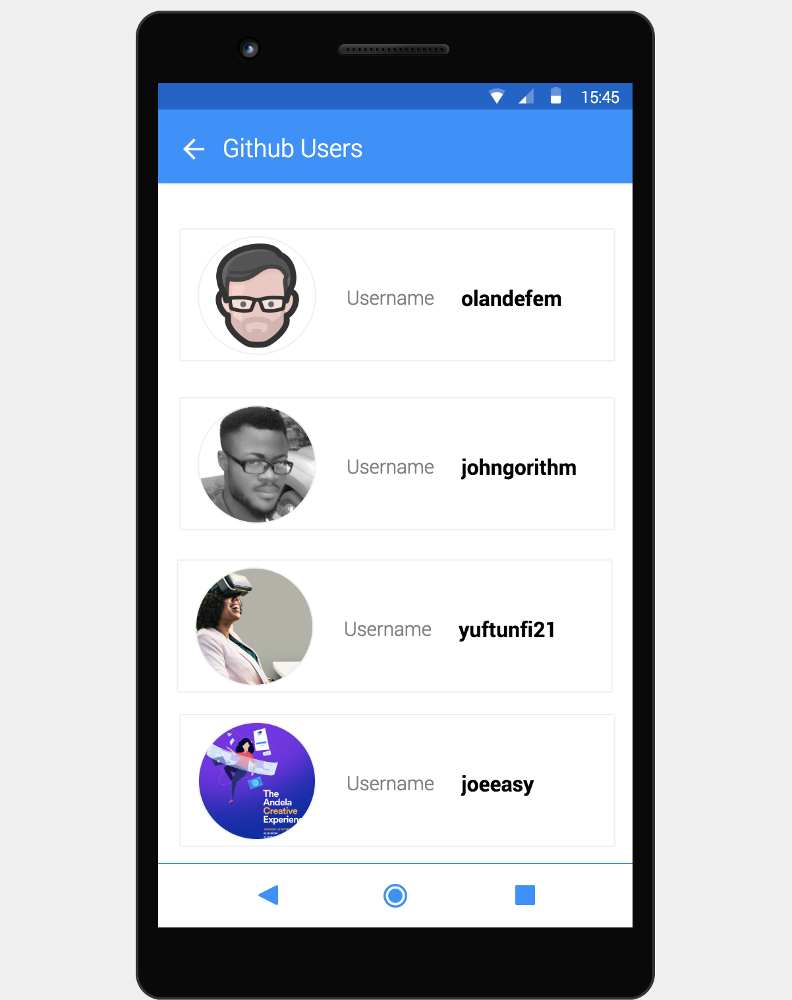
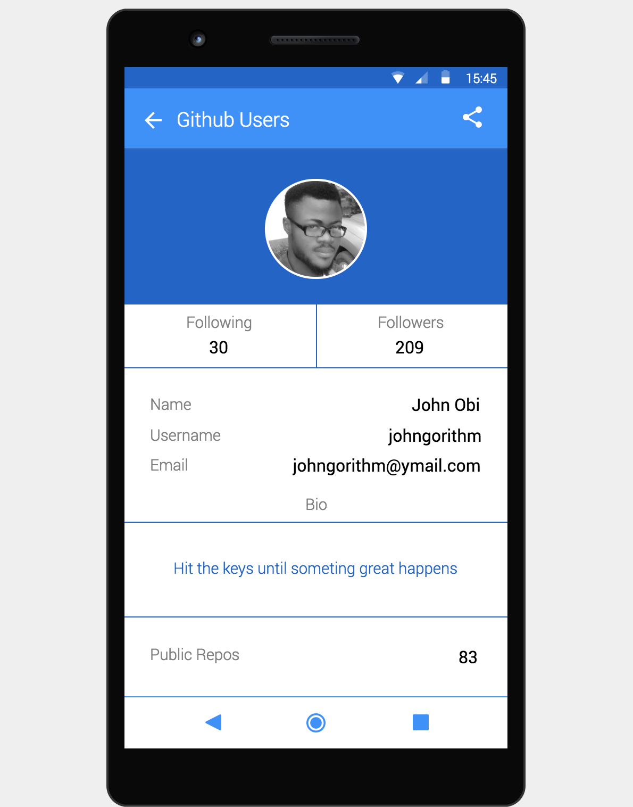

## Title: Nairobi Java Developers Github Directory

[](https://circleci.com/gh/johngorithm/github-ap-with-java)  <a href="https://codeclimate.com/github/johngorithm/github-ap-with-java/maintainability"></a>  [](https://codecov.io/gh/johngorithm/github-ap-with-java)
[](https://travis-ci.com/johngorithm/github-ap-with-java)
## Description

This app makes details of Github users from a particular location to be accessible to it's users.

### Stack
- Android
 ### Language
- Java
- XML
 ### WHY USE JUSTINMIND
JustInMind became my choice wire-framing tool as a result of the following reasons:
- It houses all that is required to fully bring out the design picture in my mind (color picker, widgets, icons, shapes, text editor, navigation, menus e.t.c).
- It is featured for both mobile and the web.
- This tool allows one to prototype one's design and making it highly interactive.
- I must say that its users experience is really great as I found it really easy to use without having to go through series of tutorials.

### Getting started

These instructions will get you a copy of the project up and running on your local machine for development and testing purposes.

#### Prerequisites
What things you need to install the software and how to install them

- [Download](https://developer.android.com/studio/) and Install Android studio
- Download and set up android emulator in Android studio via the IDE


#### Installing
A step by step series of examples that tell you how to get a development env running

- clone this [repository](https://github.com/johngorithm/github-ap-with-java.git)
- `drag` and `drop` the cloned folder into **Android Studio** to open the project
- after `Gradle build` and `indexing` is done,
- `run` the app with `Run button` provided by Android studio on the downloaded emaulator or physical android device.


### Running the tests
Explain how to run the automated tests for this system
- after project set up, open up **Android studio** integrate `terminal`
- To run code static analysis
  - ` ./gradlew check ` - To run all
  - ` ./gradlew lint `  - To run `lint` check
  - ` ./gradlew findbugs `  - To run `findbugs` check
  - ` ./gradlew pmd `  - To run `pmd` check
  - ` ./gradlew checkstyle `  - To run `checkstyle` check
- To run **unit tests**
  - ```./gradlew testDebugUnitTest```
  - ```./gradlew test ```
- To run **instrumented tests**
  - `./gradlew connectedAndroidTest`
  - `./gradlew connectedDebugAndroidTest`
- To **build** and collect **Code Coverage**, run
  - ```./gradlew clean build jacocoTestReport```
  - generated coverage is found in the following directory ```app/build/reports/jacocoReport/html/```


### COLOR THEME
- **Dark** - #0063cb
- **Light** - #6fc0ff
- **Primary** - #1e90ff


### Project's UI Designs

#### ListView


#### DetailView


#### ShareView


#### AUTHOR
[@Johngorithm](https://github.com/johngorithm)

#### ACKNOWLEDGEMENT
Special thanksgiving to [@Andela](https://andela.com) for making available to me a conducive learning environment and resources while availing me of a supportive and passionate community of great mind.

I also would like to thank [@TheDancerCodes](https://github.com/theDancerCodes) for being an awesome and inspiring Team Lead

My Final appreciation goes to [@Petermwash](https://github.com/petermwash) for his support, feedback, care and encouragement during the course of this project.